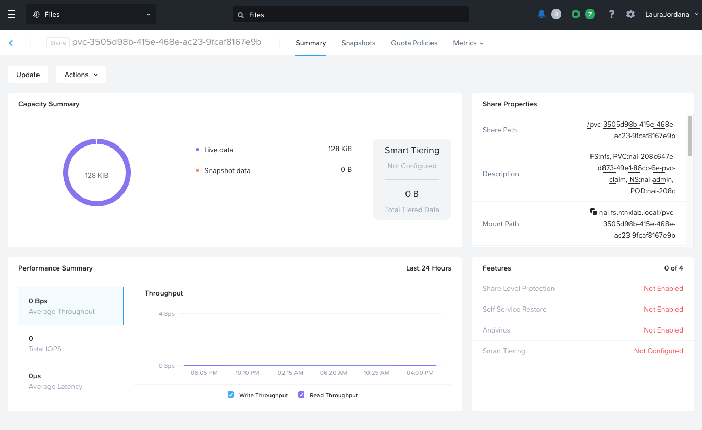
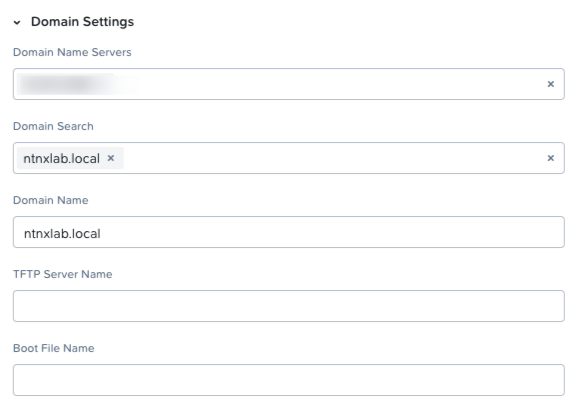

(WIP)
## Downloading a model
When you download a model, a kubernetes job is created that kicks off a temporary nai-model-processor container in the `nai-admin` namespace. This container pulls the nai-model-processor image from the docker registry. It has several environment variables set, including the model image to download (e.g. nvcr.io/nim/meta/llama-3.1-8b-instruct:1.2.2) and the API key via Kubernetes secret. This container creates the PV/PVC and mounts the volume.

```
[nutanix@dm3-poc139-jumphost ~]$ k get pods
NAME                                                        READY   STATUS              RESTARTS      AGE
nai-e854aada-cefe-44f6-b8fe-62-model-job-g77w6              0/1     ContainerCreating   0             2s
[nutanix@dm3-poc139-jumphost ~]$ k describe pod nai-e854aada-cefe-44f6-b8fe-62-model-job-g77w6
.
.
.
Events:
  Type    Reason                  Age   From                     Message
  ----    ------                  ----  ----                     -------
  Normal  Scheduled               18s   default-scheduler        Successfully assigned nai-admin/nai-e854aada-cefe-44f6-b8fe-62-model-job-g77w6 to nkp-dm3-poc139-md-0-nn6l8-s86jq-74hcc
  Normal  SuccessfulAttachVolume  18s   attachdetach-controller  AttachVolume.Attach succeeded for volume "pvc-f4b4d8d9-d025-4515-be80-11eb597f98a7"
  Normal  Pulling                 7s    kubelet                  Pulling image "registry.nutanixdemo.com/nai/nai-model-processor:latest"
  Normal  Pulled                  6s    kubelet                  Successfully pulled image "registry.nutanixdemo.com/nai/nai-model-processor:latest" in 381ms (381ms including waiting)
  Normal  Created                 6s    kubelet                  Created container process-model-container
  Normal  Started                 6s    kubelet                  Started container process-model-container
```

### Example pod logs

#### Success
```
[nutanix@dm3-poc139-jumphost ~]$ k logs nai-9ab91c9c-e09b-4d08-876d-85-model-job-czkpt | head -3
The new directory is created! - /data/model-files
The new directory is created! - /data/hf_cache

## Starting model files download from meta-llama/Meta-Llama-3.1-8B-Instruct with version 0e9e39f249a16976918f6564b8830bc894c89659
```

#### Failure - Invalid Token
```
[nutanix@dm3-poc139-jumphost ~]$ k logs nai-98d39610-1f25-4ddc-942a-a1-model-job-z6skh
Token unauthorized to access Hugging Face Repo: 403 Client Error. (Request ID: Root=1-67206f34-21a588a3768f83e42c680ba3;8d92a79f-ff32-43a8-a44d-116bab3dff11)

Cannot access gated repo for url https://huggingface.co/api/models/google/gemma-2-2b-it/commits/299a8560bedf22ed1c72a8a11e7dce4a7f9f51f8.
Access to model google/gemma-2-2b-it is restricted and you are not in the authorized list. Visit https://huggingface.co/google/gemma-2-2b-it to ask for access.
```

```
[nutanix@localhost ~]$ k get pv -n nai-admin | grep nai-admin
pvc-3505d98b-415e-468e-ac23-9fcaf8167e9b   47Gi       RWX            Delete           Bound    nai-admin/nai-208c647e-d873-49e1-86cc-6e-pvc-claim                                     nai-nfs-storage   <unset>                          3m9s
[nutanix@localhost ~]$ k get pvc -n nai-admin
NAME                                       STATUS   VOLUME                                     CAPACITY   ACCESS MODES   STORAGECLASS      VOLUMEATTRIBUTESCLASS   AGE
nai-208c647e-d873-49e1-86cc-6e-pvc-claim   Bound    pvc-3505d98b-415e-468e-ac23-9fcaf8167e9b   47Gi       RWX            nai-nfs-storage   <unset>                 3m25s
```

### NIM model download
When you download a NIM model, the share is created on the file server (assuming the StorageClass configuration is set to dynamic provisioning) but the model isn’t actually downloaded yet until the endpoint is created.



When the endpoint is created with NIM, you see the model pull happening in the pod logs. Took about 8 min

```
[nutanix@dm3-poc139-jumphost ~]$ k describe pods nim-endpoint-predictor-00001-deployment-5f95577b68-cxwn4 -n nai-admin | tail -3
  Normal   Scheduled               3m46s                  default-scheduler        Successfully assigned nai-admin/nim-endpoint-predictor-00001-deployment-5f95577b68-cxwn4 to nkp-dm3-poc139-gpu-nodepool-hxp4p-jqx8n-2f978
  Normal   SuccessfulAttachVolume  3m45s                  attachdetach-controller  AttachVolume.Attach succeeded for volume "pvc-a3e7cef3-82e5-4cae-a821-e2a593a02392"
  Normal   Pulling                 3m41s                  kubelet                  Pulling image "nvcr.io/nim/meta/llama-3.1-8b-instruct@sha256:e990eb6915c0917509318942bb5440291b0a2d498bdd6f2ebc1b8dfc4580f2d4"
  ```

### Troubleshooting
If the volume fails to mount because of DNS resolution errors to the file server, double check the networking configuration and ensure that the Kubernetes nodes are on a network that is set to search the domain of the file server.

E.g. the nai-model-processor container fails to start with the following error:

```
MountVolume.SetUp failed for volume "pvc-96f09e5d-0a40-487a-8b02-ca1597feb404" : rpc error: code = Internal desc = rpc error: code = Internal desc = mount failed: exit status 32
Mounting command: mount
Mounting arguments: -t nfs nai-fs.ntnxlab.local:/pvc-96f09e5d-0a40-487a-8b02-ca1597feb404 /var/lib/kubelet/pods/efb52398-ecc9-478b-9f86-9a0303e40bf4/volumes/kubernetes.io~csi/pvc-96f09e5d-0a40-487a-8b02-ca1597feb404/mount
Output: mount.nfs: Failed to resolve server nai-fs.ntnxlab.local: Name or service not known
```

Check the network settings to ensure the search domain is set. For example, on an AHV network, make sure the domain settings have the domain in the “Domain Search” field. 



#### How to check DNS resolution on Kubernetes pods
```
kubectl apply -f https://k8s.io/examples/admin/dns/dnsutils.yaml
kubectl get pods dnsutils
kubectl exec -it dnsutils -- nslookup ntnxlab.local
kubectl exec -it dnsutils -- nslookup nai-fs.ntnxlab.local
kubectl exec -it dnsutils -- cat /etc/resolv.conf
```