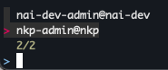

# Managing Multiple NKP Clusters

## Creating a new cluster and getting the config
1. Understand what available IPs you have to allocate to the new NKP cluster
1. Ensure you have the required resources.
1. Create new cluster from NKP dashboard or from CLI
1. Get the cluster config
   *  Get the namespace that corresponds with your workspace
        ```
        nkp get workspaces
        ```
   * Get the cluster name if needed
        ```
        nkp get clusters -w <workspace-name>
        ```
   * Get the kubeconfig
        ```
        nkp get kubeconfig -c <cluster-name> -n <namespace>
        ```

## One-liner to get configs for all managed clusters from NKP

```
kubectl get clusters -A -o jsonpath='{range .items[*]}{.metadata.namespace}{" "}{.metadata.name}{"\n"}{end}' | xargs -n2 sh -c 'nkp get kubeconfig -c "$1" -n "$0" > ${HOME}/.kube/"$0_$1".yml'
```

## Using kubie to easily switch between contexts

Installation on Linux x86
```
wget https://github.com/sbstp/kubie/releases/download/v0.26.0/kubie-linux-amd64
sudo mv kubie-linux-amd64 /usr/local/bin/kubie
chmod +x /usr/local/bin/kubie
```

## Switch contexts
```
kubie ctx
```

This will present a list of contexts it found from the config files it found in `${HOME}/.kube`, e.g.



For more information see https://github.com/sbstp/kubie?tab=readme-ov-file#usage